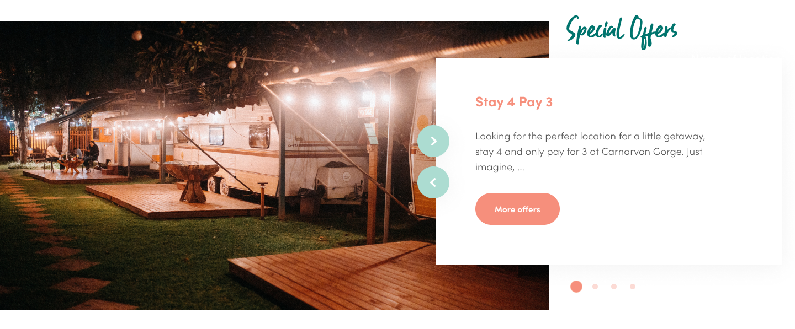

# Fastrack Digital Developers Test

Your task is to create the slider as shown in `_resources/slider.png`.
Your solution should be mobile responsive. Use your own judgement to
determine how the design should sit for various breakpoints.




## What we are looking for

We are looking for candidates with an eye for detail and with the ability to
write clean and maintainable code.

Some questions we will ask will be:

* Would your solution require extra work before presenting to a client?
* How easy would it be to edit your code if changes needed to be made?
* How well are you at judging how the design should look for different breakpoints?


## Requirements

Your solution must meet the following:

* Use [Splide slider](https://splidejs.com/)
* All styling must only be in `css/src/main.scss`
* All JavaScript must only be in `javascript/src/main.js`
* No other libraries should be used apart from Bootstrap and Splide
* Your solution should be mobile responsive
* The project must be able to be built error free using `npm run production`
* Use the images located in the `images` directory only
* Do not use CSS background images use `` tags


## Building

Node Version: 16

You will need to have HTTP server to view the site. A simple way to do this
is by using Python.

Run this command in the project directory,
and you can access the site from [localhost:8080](http://localhost:8080).
You can change the port number if needed

```shell
python3 -m http.server 8080
```

### Development

Install by running

```shell
npm install
```
To run the file watches, open two terminal instances and then run these commands in each instance

```shell
npm run watch-css
```

```shell
npm run watch-js
```

There is no browser sync installed in this project


### Production

To quickly build the project without file watches, you can run the production task

```shell
npm install
npm run production
```


